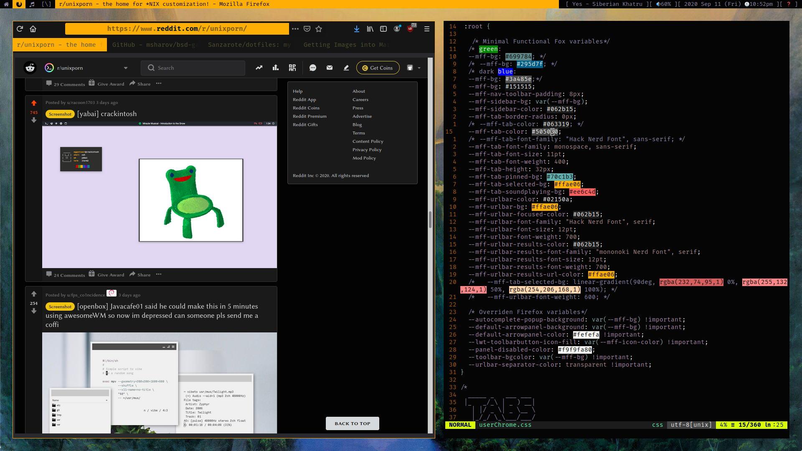
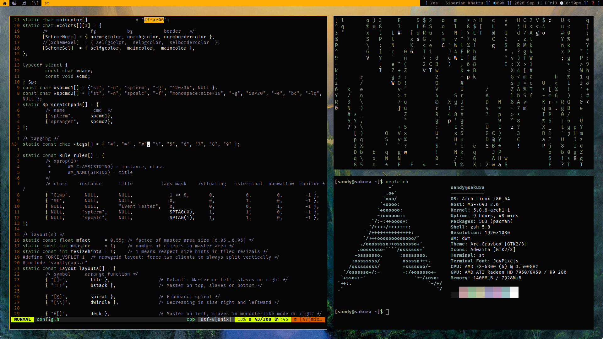
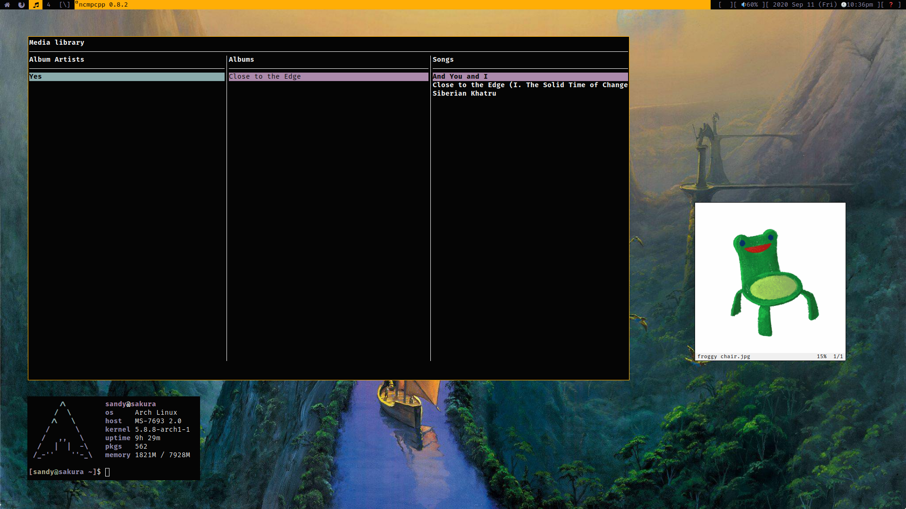
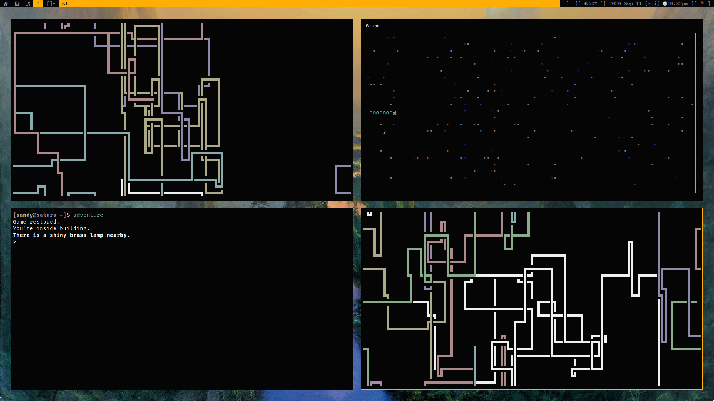

# dotfiles
My archlinux dotfiles. Now with wallpapers!  
This is all for personal use really, so don't expect this to be well organised.  
It all makes sense in MY head, ok? lol

My dwm config is at [this repo](https://github.com/Sanzarote/dwm)

## Screenshots

